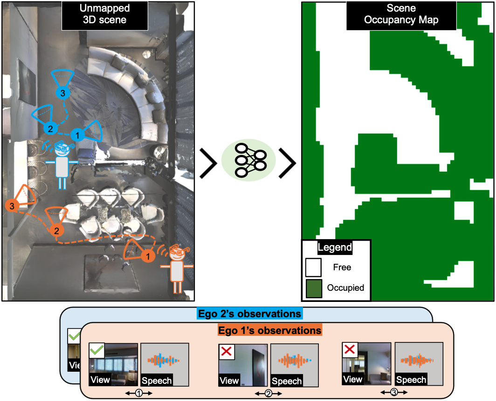

# Chat2Map
This repository contains the PyTorch implementation of our paper and the associated datasets: 

[Chat2Map: Efficient Scene Mapping from Multi-Ego Conversations](https://vision.cs.utexas.edu/projects/chat2map/)<br />
Sagnik Majumder, Hao Jiang, Pierre Moulon, Ethan Henderson, Paul Calamia, Kristen Grauman\*, Vamsi Krishna Ithapu\*<br />
UT Austin, Reality Labs at Meta, FAIR at Meta<br />
CVPR 2023<br /><br />
\* denotes equal contribution

Project website: [https://vision.cs.utexas.edu/projects/chat2map/](https://vision.cs.utexas.edu/projects/chat2map/)

<p align="left">
  
</p>

## Abstract
Can conversational videos captured from multiple egocentric viewpoints reveal the map of a scene in a cost-efficient way? We seek to answer this question by proposing a new problem: efficiently building the map of a previously unseen 3D environment by exploiting shared information in the egocentric audio-visual observations of participants in a natural conversation. Our hypothesis is that as multiple people (“egos") move in a scene and talk among themselves, they receive rich audio-visual cues that can help uncover the unseen areas of the scene. Given the high cost of continuously processing egocentric visual streams, we further explore how to actively coordinate the sampling of visual information, so as to minimize redundancy and reduce power use. To that end, we present an audio-visual deep reinforcement learning approach that works with our shared scene mapper to selectively turn on the camera to efficiently chart out the space. We evaluate the approach using a state-of-the-art audio-visual simulator for 3D scenes as well as real-world video. Our model outperforms previous state-of-the-art mapping methods, and achieves an excellent cost-accuracy tradeoff.

## Dependencies
This code has been tested with ```python 3.6.13```, ```habitat-api 0.1.4```, ```habitat-sim 0.1.4``` and ```torch 1.4.0```. Additional python package requirements are available in ```requirements.txt```.   
  
First, install the required versions of [habitat-api](https://github.com/facebookresearch/habitat-lab), [habitat-sim](https://github.com/facebookresearch/habitat-sim) and [torch](https://pytorch.org/) inside a [conda](https://www.anaconda.com/) environment. 

Next, install the remaining dependencies either by 
```
pip3 install -r requirements.txt
``` 
or by parsing ```requirements.txt``` to get the names and versions of individual dependencies and install them individually.

## Datasets
Download the additional data needed for running the code from this [link](https://dl.fbaipublicfiles.com/chat2map/data.zip) under the project root, extract its contents into a directory named ```data```. The ```data``` directory should have 7 subdirectories
1. **datasets**: conversation episodes for training and evaluating the model for MP3D scenes
2. **gt_topdown_maps**: pre-processed topdown occupancy maps for using as inputs and targets for the model for MP3D scenes
3. **metadata**: empty directory for storing metadata describing the discrete grid of MP3D scenes 
4. **noise**: sensor noise data for evaluating with sensor noise for MP3D scenes
5. **scene_observations**: empty directory for storing cached RGB and depth images from MP3D scenes
6. **sounds**: anechoic speech and distractor (ambient environment) sounds for training and evaluation for MP3D scenes
7. **ambisonic_rirs**: empty dir for storing ambisonic IRs for MP3D scenes 
    
Download the [SoundSpaces](https://github.com/facebookresearch/sound-spaces/blob/main/soundspaces/README.md) Matterport3D **ambisonic RIRs** and **metadata**, and extract them into directories named ```data/ambisonic_rirs/mp3d``` and ```data/metadata/mp3d```, respectively.    
     
Download the [Matterport3D](https://niessner.github.io/Matterport/) dataset, and cache the observations relevant for the SoundSpaces simulator using [this script](https://github.com/facebookresearch/sound-spaces/blob/main/scripts/cache_observations.py) from the [SoundSpaces repository](https://github.com/facebookresearch/sound-spaces). Use resolutions of ```128 x 128``` for both RGB and depth sensors. Place the cached observations for all scenes (.pkl files) in ```data/scene_observations/mp3d```.  Also, copy or symlink the scene directories under ```habitat_data/v1/tasks/mp3d_with_semantics``` of the downloaded MP3D dataset folder, which contain ```.glb```, ```.house```, ```.navmesh``` and ```.ply``` files, in ```data/scene_datasets/mp3d```.
      
Next, ```cd``` into ```data/noise/gaussian_rgb_sensor_noise``` and run ```ln -s ../redwood_depth_sensor_noise/seed0_h128w128.pkl ./seed0_h128w128_mu0.0sigma1.0.pkl``` and ```ln -s ../redwood_depth_sensor_noise/seed0_h128w128_1000eps.pkl ./seed0_h128w128_mu0.0sigma1.0_1000eps.pkl```.   
       
For further info about the structuring of the associated datasets, refer to ```chat2map/config/default.py``` or the task configs.

## Code
###### Passive mapping training    
4 GPU DataParallel training: 
```
CUDA_VISIBLE_DEVICES=0,1,2,3 python3 main.py --exp-config chat2map/config/passive_mapping/train.yaml --model-dir runs/passive_mapping --run-type train NUM_PROCESSES 1
``` 

###### Passive mapping testing       
4 GPU DataParallel testing on simulated data :
```
CUDA_VISIBLE_DEVICES=0 python3 main.py --exp-config chat2map/config/passive_mapping/test.yaml --model-dir runs_eval/passive_mapping/ --run-type eval EVAL_CKPT_PATH runs_eval/passive_mapping/data/best_ckpt_val.1.pth NUM_PROCESSES 1
```   

Compute average map quality metrics, like F1 score and IoU, using ```scripts/map_quality/compute_avgMetricVals_passiveMapping.ipynb```.     
      
###### Active mapping training 
**Note**: active mapping training with 8 GPU DDPPO with 8 processes per GPU requires ~490 GBs of CPU memory.
   
    
8 GPU + 8 process DDPPO training of random agent:
```
CUDA_VISIBLE_DEVICES=0,1,2,3,4,5,6,7 python3 -u -m torch.distributed.launch --use_env --nproc_per_node 8 main.py --exp-config chat2map/config/active_mapping/train_random.yaml --model-dir runs/random --run-type train NUM_PROCESSES 8 RL.PPO.use_ddppo True
```

8 GPU + 8 process DDPPO training of Chat2Map active mapping agent:
```
CUDA_VISIBLE_DEVICES=0,1,2,3,4,5,6,7 python3 -u -m torch.distributed.launch --use_env --nproc_per_node 8 main.py --exp-config chat2map/config/active_mapping/train_chat2map_activeMapper.yaml --model-dir runs/chat2map_activeMapper --run-type train NUM_PROCESSES 8 RL.PPO.use_ddppo True
```

###### Active mapping testing      
**Note**: before testing, symlink ```ckpt.best_reward_lastStep.pth``` from ```runs/chat2map_activeMapper``` in ```runs_eval/chat2map_activeMapper```

1 GPU + 1 process testing of ChatMap active mapping on simulated data:
```
CUDA_VISIBLE_DEVICES=0 python3 main.py --exp-config chat2map/config/active_mapping/test_chat2map_activeMapper.yaml --model-dir runs_eval/chat2map_activeMapper/ --run-type eval NUM_PROCESSES 1
```

Compute average map quality metrics, like F1 score and IoU, over all episode steps or for last step using ```scripts/map_quality/compute_avg_allSteps_n_lastStep_metricVals_activeMapping.ipynb```.     

## Model checkpoints
Coming soon!!

## Issues/bugs
Please open an issue in this repository (preferred for better visibility), or reach out to [sagnik@cs.utexas.edu](sagnik@cs.utexas.edu).

## Contributing
See the [CONTRIBUTING](CONTRIBUTING.md) file for how to help out.

## Citation
If you use the code or the paper, please cite the following paper:
```
@inproceedings{majumder2023chat2map,
  title={Chat2Map: Efficient Scene Mapping from Multi-Ego Conversations},
  author={Majumder, Sagnik and Jiang, Hao and Moulon, Pierre and Henderson, Ethan and Calamia, Paul and Grauman, Kristen and Ithapu, Vamsi Krishna},
  booktitle={Proceedings of the IEEE/CVF Conference on Computer Vision and Pattern Recognition},
  pages={10554--10564},
  year={2023}
}
```

# License
This codebase is licensed under the [CC-By-NC license](LICENSE).
